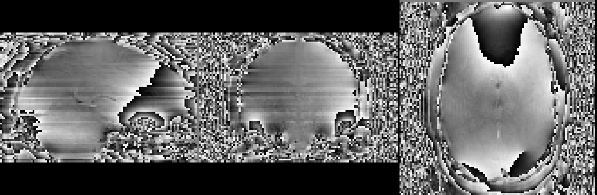
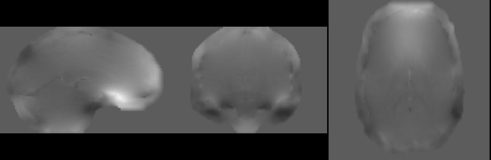

# warpkit


A python library for neuroimaging transforms

If you've landed here, you're probably interested in the Multi-Echo DIstortion Correction (MEDIC) algorithm, which this
library implements.

You can find the pre-print for MEDIC here: https://www.biorxiv.org/content/10.1101/2023.11.28.568744v1.

See below for usage details.

## Installation

### Julia

`warpkit` requires `julia` installed on your system ensure that you have the `julia` executable in your path, and
the `julia` libraries correctly setup in your `ld.so.conf`. See the below instructions for both Linux and macOS.

#### Linux

If you installed julia via a package manager, library configuration should be done for you (most of the time) already.
However, if you installed Julia manually, you may need to tell `ldconfig` where the julia libraries are. For example,
on debian based systems you can do this with:

```bash
# /path to julia installation (the lib folder will have libjulia.so)
echo /path/to/julia/lib > /etc/ld.so.conf.d/julia.conf
ldconfig
```

If you have done this correctly, you should see `libjulia.so` in your ldconfig:

```bash
ldconfig -p | grep julia                                                                                        
	libjulia.so.1 (libc6,x86-64) => /usr/lib/libjulia.so.1
	libjulia.so (libc6,x86-64) => /usr/lib/libjulia.so
```

The above may require root privileges. The alternative to the above is to set the `LD_LIBRARY_PATH` environment
variable to the path of the julia libraries.

```bash
# /path to julia installation (the lib folder will have libjulia.so)
export LD_LIBRARY_PATH=/path/to/julia/lib:$LD_LIBRARY_PATH
```

Note however, that you must type the above each time you open a new terminal. To make this permanent, you can add the
above line to your shell's profile file.

#### macOS

If you installed julia through `brew`, this should be done for you already.

However, if you get an error saying that `libjulia` cannot be found, you may need to add the julia libraries via your
`DYLD_LIBRARY_PATH` environment variable. For example, if you installed julia to `/Applications/Julia-1.6.app`, you
would add the following to your shell's profile file:

```bash
export DYLD_LIBRARY_PATH=/Applications/Julia-1.6.app/Contents/Resources/julia/lib:$DYLD_LIBRARY_PATH
```

### Installing through pip

Assuming you have `julia` installed and configured correctly, you can install `warpkit` through `pip`:

```bash
pip install warpkit
```

If you encounter any errors during the installation process, please report them to the issue tracker with the logs
reported from `pip install warpkit -v`.

### Installing through conda

Another way to install `warpkit` is through a `conda` environment. Currently, `warpkit` is not uploaded to any
`conda` channels, so you will need to build it from source (Looking for help on this
[issue](https://github.com/vanandrew/warpkit/issues/6)).

> [!NOTE]
> **For advanced users only**
> A `meta.yaml` file is present in the `conda` folder in the root of the repo. If you are familiar with `conda-build`
> you should be able to build this with your existing `conda` install.

Fortunately, there is an automated script that will download `micromamba` (a `conda` variant), create a new
environment, and build/install `warpkit` for you automagically. To do this, clone this repo and run the following:

```bash
# switch to conda directory in repo
cd conda
# run the install script (use -p or --path to specify an install prefix)
# by default this is set to ~/micromamba
./warpkit-conda-install.sh

# in your shell profile add the following lines
# or just execute them in your current shell
# but it won't be permanent
export MAMBA_ROOT_PREFIX=/whatever/path/you/installed/micromamba/prefix/above
eval "$(/whatever/path/you/installed/micromamba/prefix/above/bin/micromamba shell hook -s posix)"

# if you added the above to your profile
# restart your shell then activate the environment
#
# unless you have already executed the above in your current shell
# then you don't need to restart it and can just activate the environment
micromamba activate base

# you should now be able to import/use warpkit
python -c "import warpkit"  # should return no errors
medic --help  # should return help
```

After installing and configuring everything, you must type `micromamba activate base` each time you open a new terminal
to get back into the `conda` environment to use `warpkit`. To make this permanent, you can add the above line to your
shell's profile file.

### Installing through docker

If you are familiar with `docker`, you can also install `warpkit` through a `docker` container.

```bash
docker run -it --rm ghcr.io/vanandrew/warpkit:latest
```

Note that the default entrypoint is the `medic` CLI script, so you can run `medic --help` to get the help message.

### Building and installing from source

To build and install from source, clone this repo and run the following in the repo directory.
I highly recommend installing it in editable mode (with the strict option, see
[here](https://setuptools.pypa.io/en/latest/userguide/development_mode.html#strict-editable-installs)):

```
pip install -e ./[dev] -v --config-settings editable_mode=strict
```
You will need a C++ compiler with C++17 support, as well as Julia pre-installed on your system. See the [Julia](#julia)
section for more details.

The build process uses CMake to build the C++/Python Extension. If you encounter an error during the build process,
please report the full logs of the build process using the `-v` flag to the `pip` command above. 

## What is MEDIC?

MEDIC takes your ME-EPI phase data from this:



to this:



for each frame of your data. You can then use these field maps to distortion correct your data.

## MEDIC Usage
The `warpkit` library is meant for integration into a larger neuroimaging pipeline/software package.

An example of how to call MEDIC from python is provided below:
```python
import nibabel as nib
from warpkit.distortion import medic
from warpkit.utilities import displacement_map_to_warp

# load phase and magnitude images into lists
# each element in list is a different echo
phases = [nib.load(p) for p in phases_paths]
magnitudes = [nib.load(p) for p in magnitude_paths]
TEs = [TE1, TE2, ...] # in milliseconds
effective_echo_spacing = ... # in seconds
phase_encoding_direction = either i, j, k, i-, j-, k-, x , y, z, x-, y-, z- 

# call the medic function
field_maps_native, displacement_maps, field_maps = medic(
    phases, magnitudes, TEs, effective_echo_spacing, phase_encoding_direction)

# field_maps_native are returned in the distorted space (Hz) (mainly for reference/debugging purposes)
# you shouldn't need to use these probably???
# displacement_maps are returned in the undistorted space (mm) (see below for usage)
# field_maps are returned in the undistorted space (Hz) (same field map output as topup/fugue, but framewise)

# returns are nibabel Nifti1Image objects, so they can be saved to file by:

# displacement_maps to file
displacement_maps.to_filename("/path/to/save.nii.gz")

# these should be converted to displacement fields
# by the displacement_map_to_field function
# and specifying the appropriate type (i.e. itk, ants, afni, fsl)

displacement_field = displacement_map_to_field(displacement_maps, axis="y", format="itk", frame=0)

# where axis specifies the phase encoding direction, format is the desired output format, and frame is the index of
# displacement map to convert to a displacement field

# the displacement field can then be saved to file by the to_filename method
# Each file can be applied with the respective software's displacement field application tool:
# itk: the internal format warpkit uses. See utilities.resample_image
# ants: antsApplyTransforms (note that even though ants also uses itk, warpkit's itk warp format is NOT equivalent)
# afni: 3dNwarpApply
# fsl: applywarp

# if you are using fsl and instead want to use fugue to distortion correction, you can use the field_maps outputs
# (these are the equivalent field maps of that you would get from fugue, but with multiple frames)
```

You can also use the provided CLI script `medic` to run MEDIC from the command line. The script is installed to your
`PATH` when you install the package. `medic` takes the following arguments:

```bash
usage: medic [-h] --magnitude MAGNITUDE [MAGNITUDE ...] --phase PHASE
             [PHASE ...] --metadata METADATA [METADATA ...]
             [--out_prefix OUT_PREFIX] [-f NOISEFRAMES] [-n N_CPUS]
             [--debug] [--wrap_limit]

Multi-Echo DIstortion Correction

options:
  -h, --help            show this help message and exit
  --magnitude MAGNITUDE [MAGNITUDE ...]
                        Magnitude data
  --phase PHASE [PHASE ...]
                        Phase data
  --metadata METADATA [METADATA ...]
                        JSON sidecar for each echo
  --out_prefix OUT_PREFIX
                        Prefix to output field maps and displacment maps.
  -f NOISEFRAMES, --noiseframes NOISEFRAMES
                        Number of noise frames
  -n N_CPUS, --n_cpus N_CPUS
                        Number of CPUs to use.
  --debug               Debug mode
  --wrap_limit          Turns off some heuristics for phase unwrapping

Vahdeta Suljic <suljic@wustl.edu>, Andrew Van <vanandrew@wustl.edu>
12/09/2022
```
