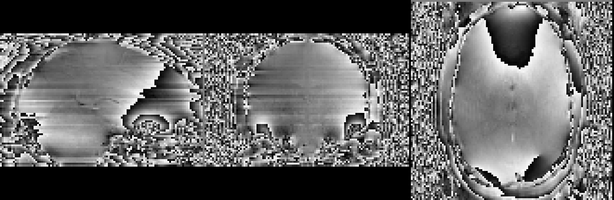
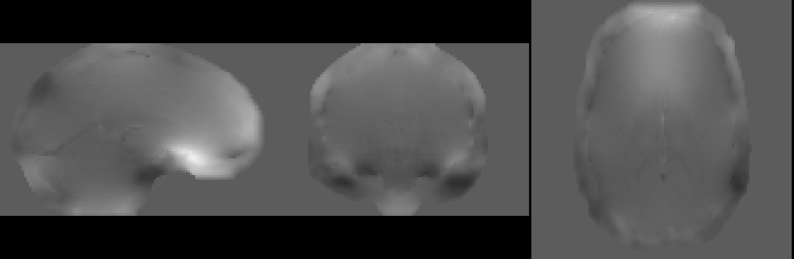

# warpkit

[](https://github.com/vanandrew/warpkit/actions)
[](https://pypi.org/project/warpkit/)
[](https://github.com/vanandrew/warpkit/pkgs/container/warpkit)
[](https://codecov.io/gh/vanandrew/warpkit)

A Python library for neuroimaging transforms, focused on the Multi-Echo DIstortion Correction (MEDIC) algorithm. The pre-print is available at <https://www.biorxiv.org/content/10.1101/2023.11.28.568744v1>.

The phase-unwrapping core is a self-contained C++17 port of [ROMEO](https://github.com/korbinian90/ROMEO) — there is no Julia runtime to install, and binary wheels ship with the ITK pieces statically linked. If you used an older release of warpkit that required `julia` on `PATH`, that step is gone.

## Installation

### From PyPI (recommended)

```bash
pip install warpkit
```

Pre-built wheels are published for Linux (x86_64 + aarch64) and macOS (universal2). If `pip` falls back to a source build and fails, please open an issue with the output of `pip install warpkit -v`.

### Standalone binaries (no Python required)

Each [GitHub release](https://github.com/vanandrew/warpkit/releases) attaches a zip per arch (`linux-x86_64`, `linux-aarch64`, `macos-arm64`) containing all seven `wk-*` CLIs as standalone binaries — no Python install or system ITK needed. Extract, add to `PATH`, and run. See the bundled `README.md` inside the zip for install/PATH instructions and the macOS Gatekeeper note.

### Docker

```bash
docker run -it --rm ghcr.io/vanandrew/warpkit:latest --help
```

The image's entrypoint is the `wk-medic` CLI.

### From source

You need a C++17 compiler and CMake ≥ 3.24. Everything else (Python, build deps, ITK) is resolved by [uv](https://docs.astral.sh/uv/).

```bash
git clone https://github.com/vanandrew/warpkit.git
cd warpkit
uv sync --group dev --config-setting editable_mode=strict
```

`editable_mode=strict` is the [recommended setuptools editable layout](https://setuptools.pypa.io/en/latest/userguide/development_mode.html#strict-editable-installs) — it avoids the import-path pitfalls of the default editable install. Append `-v` to `uv sync` if a build fails and include the full log when reporting the issue.

## What is MEDIC?

MEDIC takes ME-EPI phase data:



and turns it into a per-frame field map:



You can then use these field maps to distortion-correct your data.

## Using MEDIC

`warpkit` is meant to be integrated into a larger neuroimaging pipeline. The Python entry point:

```python
import nibabel as nib
from warpkit.distortion import medic
from warpkit.utilities import displacement_map_to_field

# each list entry is a different echo
phases = [nib.load(p) for p in phases_paths]
magnitudes = [nib.load(p) for p in magnitude_paths]
TEs = [TE1, TE2, ...]                     # milliseconds
total_readout_time = ...                  # seconds
phase_encoding_direction = ...            # one of i, j, k, i-, j-, k-, x, y, z, x-, y-, z-

field_maps_native, displacement_maps, field_maps = medic(
    phases, magnitudes, TEs, total_readout_time, phase_encoding_direction
)
```

Returns are `nibabel.Nifti1Image` objects:

- `field_maps_native` — field maps in distorted space (Hz). Mostly useful for debugging.
- `displacement_maps` — displacement in undistorted space (mm). Convert with `displacement_map_to_field` before applying.
- `field_maps` — field maps in undistorted space (Hz). Equivalent to topup/fugue output, but framewise.

To convert a displacement map to a per-frame warp field for your tool of choice:

```python
displacement_maps.to_filename("/path/to/save.nii.gz")

displacement_field = displacement_map_to_field(
    displacement_maps, axis="y", format="itk", frame=0
)
```

`format` selects the output convention. Apply with the matching tool:

| `format` | Apply with                 | Notes                                                                  |
| -------- | -------------------------- | ---------------------------------------------------------------------- |
| `itk`    | `warpkit.utilities.resample_image` | warpkit's internal format.                                     |
| `ants`   | `antsApplyTransforms`      | ANTs uses ITK underneath, but its warp convention differs from ours.   |
| `afni`   | `3dNwarpApply`             |                                                                        |
| `fsl`    | `applywarp`                | If you'd rather use `fugue`, feed it `field_maps` instead.             |

### CLI

All warpkit CLIs are installed on `PATH` with a `wk-` prefix to avoid colliding
with same-named tools from FSL/ANTs/AFNI/etc.:

| Command                | Purpose                                                                               |
| ---------------------- | ------------------------------------------------------------------------------------- |
| `wk-medic`             | End-to-end MEDIC pipeline: phase + magnitude → field maps + displacement maps.        |
| `wk-unwrap-phase`      | Stage 1: ROMEO multi-echo phase unwrapping → unwrapped phase + per-frame masks.       |
| `wk-compute-fieldmap`  | Stage 2: take stage-1 outputs → native + displacement + undistorted-space field maps. |
| `wk-apply-warp`        | Resample an image through a displacement map / field (single or per-frame series).   |
| `wk-convert-warp`      | Convert between maps ↔ fields and between ITK / FSL / ANTs / AFNI; `--invert` warps. |
| `wk-convert-fieldmap`  | Convert between mm displacement maps/fields and Hz B0 field maps.                    |
| `wk-compute-jacobian`  | Per-voxel Jacobian determinant (1 = no change, <1 = compression, >1 = expansion).     |

`wk-medic` runs the full pipeline; `wk-unwrap-phase` + `wk-compute-fieldmap`
run the same thing in two stages so you can inspect/reuse the unwrapped
phase. Acquisition parameters can come either from BIDS sidecars or from the
command line — pick one.

From BIDS sidecars:

```bash
wk-medic \
  --magnitude mag_e1.nii.gz mag_e2.nii.gz mag_e3.nii.gz \
  --phase phase_e1.nii.gz phase_e2.nii.gz phase_e3.nii.gz \
  --metadata mag_e1.json mag_e2.json mag_e3.json \
  --out-prefix sub-01_run-01
```

`EchoTime` is read per file (seconds → converted to ms internally); `TotalReadoutTime` and `PhaseEncodingDirection` are taken from the first sidecar.

Or by passing acquisition parameters directly:

```bash
wk-medic \
  --magnitude mag_e1.nii.gz mag_e2.nii.gz mag_e3.nii.gz \
  --phase phase_e1.nii.gz phase_e2.nii.gz phase_e3.nii.gz \
  --TEs 14.2 38.93 63.66 \
  --total-readout-time 0.0501 \
  --phase-encoding-direction j- \
  --out-prefix sub-01_run-01
```

`--TEs` is in **milliseconds**, `--total-readout-time` in **seconds**, and `--phase-encoding-direction` is one of `i, j, k, i-, j-, k-, x, y, z, x-, y-, z-`.

Run any `wk-*` CLI with `--help` for the full option list.

#### Common follow-on workflows

Apply a MEDIC displacement-map series to the BOLD it was derived from
(per-frame distortion correction):

```bash
wk-apply-warp \
  --input bold.nii.gz \
  --transform sub-01_run-01_displacementmaps.nii \
  --phase-encoding-axis j \
  --output bold_corrected.nii.gz
```

Convert MEDIC's per-frame displacement maps into per-frame ANTs-format
displacement fields:

```bash
wk-convert-warp \
  --input sub-01_run-01_displacementmaps.nii \
  --to field --axis j --to-format ants \
  --output field_{0..14}.nii.gz
```

Compute the per-frame Jacobian determinant (volume-change map) of those
displacement maps:

```bash
wk-compute-jacobian \
  --input sub-01_run-01_displacementmaps.nii \
  --axis j \
  --output sub-01_run-01_jacobian.nii
```

Convert MEDIC's mm displacement maps to a Hz B0 field map (or back —
this CLI handles either direction, with maps or fields on the mm side):

```bash
wk-convert-fieldmap \
  --input sub-01_run-01_displacementmaps.nii \
  --to fieldmap \
  --total-readout-time 0.0501 \
  --phase-encoding-direction j- \
  --output sub-01_run-01_fieldmap.nii
```

## Authors

Vahdeta Suljic &lt;suljic@wustl.edu&gt;, Andrew Van &lt;vanandrew77@gmail.com&gt;
